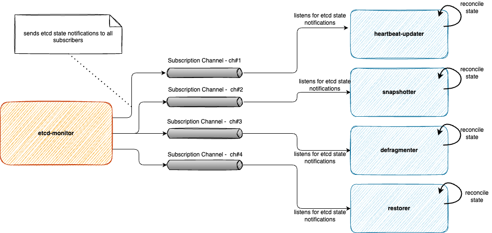

# Etcd Backup-Restore Controllers

In the current design there is no clear distinction between responsibilities amongst different actors within the backup-restore container. Thereby leading to uncontrolled usage of mutexes to fix race conditions amongst different actors.

The overall complexity of the code has also increased and the intent of this document to recommend a rather simplified design with a clear separation of concerns thereby leading to non-overlapping actors.

## Current set of responsibilities

1. Data validation operations - DB/WAL validation
1. Follows etcd leader and subsequently marks the backup-restore sidecar attached to the current etcd leader as `leading-sidecar`. This is done to ensure that certain activities like taking snapshots, defragmentation etcd are only done by the `leading-sidecar`.
1. Disaster recovery operations:
   1. Takes delta and full snapshots and uploads it to the configured backup-bucket which have higher reliability guarantees.
   2. Single member restoration. This is now only applicable to single node etcd clusters. For multi-node etcd clusters the leader will now bring up the new learner up to speed and subsequently promote it to a voting member.
   3. Snapshot compaction to reduce the recovery time. This is useful for single member etcd cluster restoration and full quorum loss in case of multi-node clusters.
1. DB Maintenance operations: Defragmentation - optimises the size of the DB by releasing the fragmented space left after etcd key-space compaction. This should be done for every member and is currently controlled by the leading backup-restore sidecar container.
2. Etcd cluster operations:
   1. Adding a member. 
   2. Promoting a learner to a voting member.
   3. Removing a member.  

> NOTE: In this document we will lay down a general layout of responsibilities and only detail out a subset of actors. General pattern identified can be then extended to other actors.

## Proposal



### etcd monitor

etcd monitor has the following responsibilities:
* It polls the etcd container querying its status. It categorises etcd being in one of the following states:
  * Leader - etcd member (peer container) is a leader
  * Follower - etcd member (peer container) is a follower
  * Learner - etcd member (peer container) is a learner
  * Unknown - this state signifies that backup-restore is unable to determine the state of the etcd container.

#### API
Monitor provides the following interfaces:

_EtcdStateNotifier:_

```golang
// EtcdStateNotifier is facade which allows creating and removing subscriptions. Each subscriber starts to receive notifications on etcd state.
type EtcdStateNotifier interface {
	// Subscribe registers a consumer with a given name to receive etcd state notifications on a dedicated channel which is maintained by the monitor.
	Subscribe(name string) <-chan EtcdMemberState
	// Unsubscribe unregisters the consumer and closes its subscription. This consumer will no longer receive etcd state notifications.
	Unsubscribe(name string)
}
```
Each actor a.k.a `controller` who are individually responsible for snapshotting, defragmentation etc can subscribe to etcd state notifications.

_EtcdMonitor_

The main interface for the monitor is given below.

```golang
// EtcdMonitor is a facade to monitor etcd peer container and to send notifications to all subscribers on state of etcd.
// This monitor will periodically poll the etcd container for its state and the received state is then sent to multicasted to all subscribers.
type EtcdMonitor interface {
	// Run starts the monitor which will start to poll the etcd container for its status.
	Run(ctx context.Context) error
	EtcdStateNotifier
	// Close closes the monitor and also closes all subscribers.
	Close()
}
```
During the start of the backup-restore server, an instance of `EtcdMonitor` should be created and `Run` method should be called asynchronously. The monitor will run for the lifetime of the backup-restore container. The `Run` method should never fail.

### Controllers

Every etcd pod currently runs two containers - 1) etcd container 2) backup-restore container. In the backup-restore container for every etcd member irrespective of the member state, all below mentioned controllers will always be run.

Each controller should adhere to the following principles:
* It should semantically do only one thing and it should never interfere with another controller.
* It operates using [level-triggering](https://hackernoon.com/level-triggering-and-reconciliation-in-kubernetes-1f17fe30333d) which is why it does not depend upon change of etcd member state only.
* It should save any last known etcd state for comparison to the latest etcd state which is sent to it via notifications. Each controller will have its own filtering on which states it is interested in. Only for such states it should react.
* Since the etcd state notifications are sent over a channel (with buffer capacity = 1), therefore each controller should ensure that no synchronous processing apart from recording the received state is done. This will ensure that the sender of the notification is never blocked.
* The processing within the controller reconcile loop should always be on the last captured etcd state.
* It should never close the subscription channel but instead call `EtcdStateNotifier.Unsubscribe`. Closing of a channel `must` only be done by the creator/sender and not by an actor which reads from the channel.

Keeping the above in mind, following controllers have been identified.

#### Heartbeat Updater Controller

Every etcd member pod has an associated lease which is periodically renewed which serves as its heartbeat signaling liveliness.

Heartbeat updater will subscribe to receive notifications about etcd member state. As long as the current state is not `Unknown` it will attempt to renew the lease. If the state is `Unknown` it will not renew the lease and if this state persists then the lease will automatically expire.

> NOTE: Unfortunately the heartbeat lease a.k.a etcd member lease is also used to hold additional information like: member status (leader), Peer URL TLS enablement status etc. Ideally every member should have its info + state reflected via a custom resource which allows each member to publish information that is only known within the pod either by the etcd container or backup-restore container. Also see [etcd-druid issue#206](https://github.com/gardener/etcd-druid/issues/206).

When the heartbeat updater renewes the lease it will also update the additional metadata (mentioned above) that it currently stores in the member lease resource.


#### Snapshotter Controller

Snapshot controller will have primarily the following responsibilities:
* It subscribes itself as a receiver of etcd member state notifications. It keeps track of the last captured state and checks if there is a leadership change. Irrespective of whether the etcd peer container has the leadership this controller will continue to receive notifications and update its last captured state.
* It will have another asynchronously started reconciliation loop which will only run when it is the leader else it will be stopped.
* As part of the reconciliation it will do the following:
  * Takes delta snapshots.
  * Takes full snapshots.
  * Updates the snapshot leases with the revision information.

#### Defragmenter Controller

> TODO

#### Restorer Controller

> TODO
